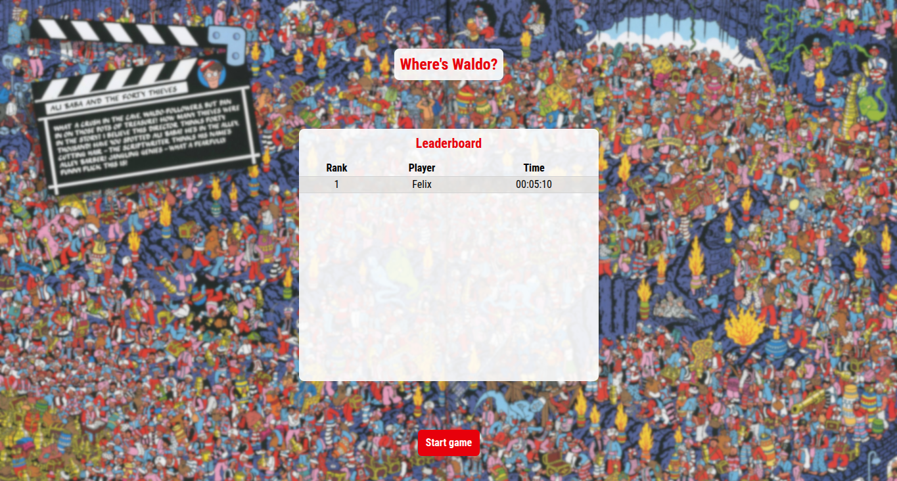
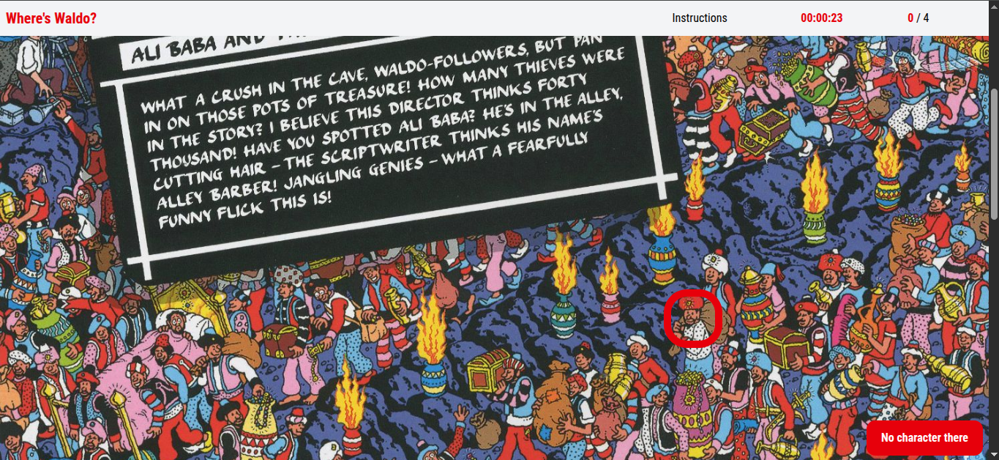
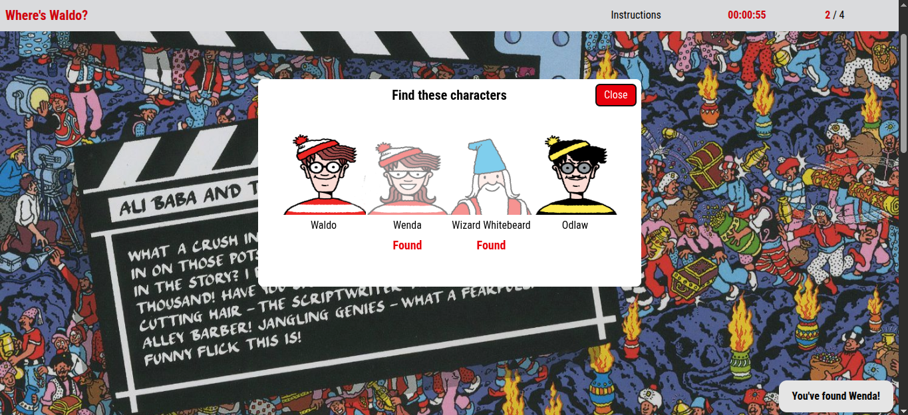

# Where's Waldo?

A photo tagging web app, part of [The Odin Project's curriculum](https://www.theodinproject.com/lessons/react-new-where-s-waldo-a-photo-tagging-app)

## Live demo

[Check out the live demo](https://wheres-waldo.felixbruguera0.workers.dev/)

## Features

- **Instant feedback**: After clicking the image you'll see a marker in the position you clicked and a notification with the result of your guess. If you found a character, the marker will be white 
- **Timer**: The game's time is tracked on the server and displayed in the client
- **Leaderboard**: The top 10 claimed scores are displayed in the leaderboard
- **Instructions**: A modal with an image of each character, with a distinct look if the character has been found

## Built with

- **Frontend**: React
- **Backend**: Hono
- **Routing**: React Router
- **Styling**: Tailwind
- **Database**: Cloudflare D1
- **Testing**: Vitest, React Testing Library
- **Libraries**: date-fns

## Screenshots

